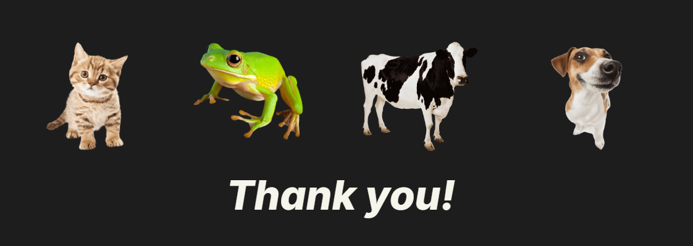

#### Final Project: AI Hardware (ECE 4501)

# ShazAnimal: Bioacoustic Animal Identifier
#### Project Group #2: Who's Calling?
#### Contributors: Ethan Jenkins (thw2nv), Eric Sheetz (fsm6wv), Bella Heintges (xvj5pd)
  
### Background
*Have you ever heard an animal sound and wondered what made it?*

The motivation for this project is to demonstrate the feasibility of deploying bioacoustic identification tools that are automated, seamless, and accessible for a wide range of users. By leveraging TinyML, the system aims to deliver efficient processing, showcasing the power of machine learning in resource-constrained environments. This enables the on-site application of audio recognition algorithms, making it a practical solution for diverse use cases. The system has potential applications in education, serving as a tool to teach children elementary concepts about nature and technology, as well as in ecological research, providing a sustainable and practical method for wildlife monitoring.
  
## Objectives
- Develop a machine learning algorithm capable of processing and identifying the animal responsible for a given audio input
- Train the model such that it is capable of classifying the sounds of 4 common animals (dog, cat, frog, cow)
- Develop a trained model able of classifying with at least an 80% accuracy
- Integrate the program with the Syntiant TinyML board, utilizing the built-in microphone, so the system can be used on-site
  
## Necessary Technology
The hardware foundation for this project includes the Syntiant TinyML board, which integrates the NDP101 Neural Decision Processor (NDP). The NDP101 is designed for efficient edge AI applications, leveraging compute-in-memory technology to achieve high parallelism and efficiency. It supports up to 589,000 parameters and delivers low-power, fast inferences on a compact 5mm x 5mm chip, making it ideal for resource-constrained environments. Additionally, the project requires a Linux or Linux-based system enabled device to host the necessary software.

On the software side, the project utilizes tools such as Git for version control, edge-impulse-cli for deploying machine learning models, and arduino-cli for interfacing with the microcontroller. Edge Impulse Studio plays a central role in managing data, training models, and deploying them to the Syntiant NDP101. This robust toolchain ensures seamless integration of machine learning workflows for real-time bioacoustic signal processing.

Below outlines the necessary technology to mimic our system development and deployment:

Hardware:
- Syntiant TinyML Board
- Linux, or Linux-based system enabled device

Software:
- Linux, or Linux-based system
- Package tools (git, edge-impulse-cli, arduino-cli)
- Edge Impulse Studio

## Methodology
To design, train, and deploy the ShazAnimal bioacoustic identification system, we followed a systematic approach that ensures reproducibility and scalability. Each step in the process builds on the previous, guiding the project from data collection to real-world deployment. Below, we outline the key steps in our methodology with links to detailed explanations for each:

| How-To Guide: |
|:-------------------|
| Step 1:  [Aggregation of Tools](methods/Tools.md) |
| Step 2:  [Data Acquisition and Research](methods/Data-Acquisition.md) |
| Step 3:  [Model Design using Edge Impulse](methods/Model-Design.md) |
| Step 4:  [Model Training and Testing](methods/Training-and-Testing.md) |
| Step 5:  [Hardware Integration](methods/Integration.md) |
| Step 6:  [Deployment and Live Demo](methods/Deployment.md) |

## Results and Discussion

### Model Performance and Results
The model's performance was evaluated using standard machine learning metrics:
- Performance Metrics
  - Training Accuracy: Achieved 86.4%, exceeding the target of 80%.
  - Training Loss: Minimal loss of 0.48, indicating strong convergence.
  - Testing Accuracy: Comparable to training results, confirming the model’s ability to generalize.
  - 

- Results Analysis
  - The model demonstrated high accuracy across most classes, with a few misclassifications in clusters where sound characteristics overlapped (e.g., dogs and frogs).
  - Model performance for each audio file:
  - 

- Confusion Matrix:
  - Visualized the distribution of true positives, false positives, and misclassifications across the four animal categories.
  - Showed high precision for cats and dogs, with minor errors in cow and frog classifications due to limited dataset size.
  - 

If issues are experienced, or additional documentation is preferred: [Edge Impulse Issues](issues/Edge-Issues.md)
  
### Hardware Integration
After the model is completed, it can be deployed on the edge device. A serial connection is the default way to receive the classification data once the model is flashed, as the board runs inferences continuously. The audio and classification data can also be sent to the Edge Impulse software to be incorporated into model training and testing, or it is simply a convenient way to store the deployed model results. Due to the issues detailed in the integration issues document, we were not able to deploy the model on the chip to run on-board model testing. However, had the model been on the board, we would have been able to find animals and use digital audio playback for testing the model. The device would classify the audio for each 3-second cycle into one of the 4 animal categories. The intention of this project was really a proof-of-concept for this application (the AI bioacoustic ID field seems surprisingly under-developed), since most people already can identify the sounds of cats, dogs, frogs and cows and none of them are rare species. So, it was unfortunate that we were not able to test this model in the field(s); but, we are confident that another approach, with a much more robust dataset, would have the capability to yield impressive results and to possibly change the field of ecologists and species preservationists. 

If issues are experienced, or additional documentation is preferred: [Hardware Integration Issues](issues/Integration-Issues.md)

### Personal Development
Through this project, several key lessons were learned that offer valuable insights for future endeavors. A major takeaway is the significant impact of processing blocks on the model's accuracy; careful selection and optimization of these blocks are crucial. It became evident that relying solely on spectrogram processing is insufficient for accurately classifying audio, highlighting the need to incorporate additional feature extraction techniques. Additionally, the importance of a robust and well-curated dataset for both training and testing processes cannot be overstated, as it directly influences the system’s performance.

Reflecting on the hardware integration process, significant challenges were encountered in establishing reliable communication between the software and the Syntiant board. Addressing these issues required ensuring that relevant tool files were accessible in the Ubuntu environment, reconfiguring the Syntiant link, and exploring device-specific workarounds. This phase highlighted the critical importance of maintaining seamless connections, accurate downloads, and properly configured profiles to enable smooth interaction between hardware and software. These challenges served as a valuable learning experience, emphasizing the need for thorough preparation and adaptability when working with advanced embedded systems.

Despite these hurdles, the project achieved its primary objectives. The system was successfully designed and is capable of accurately classifying animal calls, with defined classes tested and achieving an accuracy rate exceeding 80% with minimal loss. These results affirm the feasibility of using the Syntiant TinyML hardware for edge AI applications and pave the way for future enhancements and impactful real-world implementations.

## Expansions and Improvements
### Improvements for this Design
- Looking forward, there are several ways this project could be improved to enhance its capabilities and scope. One key improvement would be to increase the accuracy of the model by acquiring a larger dataset, with at least 500 audio files per animal to support more robust training. This would not only improve classification accuracy but also enable the addition of more animal classes, improving the system's functionality beyond its current scope. Achieving this improvement would require a targeted effort to locate and incorporate additional audio files from reliable sources.
- For a more realistic on-site implementation,and accuracy improvements, the system could integrate another processing block to streamline the identification process. This might involve combining multiple feature extraction techniques to better handle environmental noise and variability.

### Future Expansions
- This design could be expanded by incorporating a visual aid component—such as a display screen or mobile app integration—could improve user accessibility, making the system more intuitive for a broader audience.
- This system could allso become a valuable educational tool, teaching users to identify and understand animal sounds. It could engage children and adults alike through interactive learning modes, such as sound quizzes, or enhance learning experiences with augmented reality (AR) that pairs animal sounds with visual representations. This would make the system an innovative way to spark curiosity about wildlife and ecosystems.
- In survival scenarios, this design could identify potentially dangerous wildlife based on their vocalizations, helping to alert users in real time to hazards like snakes or large predators. By ensuring offline functionality, the tool could be used in remote areas without internet access, making it a reliable companion for hikers, campers, and other outdoor enthusiasts.
- For scientists and ecologists, this system could streamline biodiversity monitoring and wildlife research. With expanded classifiers and sustainable hardware, it could identify a broader range of species in real time while operating in remote environments. Automated logging of audio data and species detection would make it a powerful tool for conservation efforts and ecological studies.

*These expansions not only align with the project's goals of automation and accessibility but also lay the groundwork for future advancements in edge AI applications*

## Project Deliverables
| Date | Submission |
|:-------------------|:-------------------|
| November 7th, 2024 | [Project Proposal](Project-Proposal.md) |
| November 26th, 2024 | [Milestone 1](Milestone-1.md) |
| December 5th, 2024 |[Final Project Presentation](Final-Project-Presentation.pdf) |

